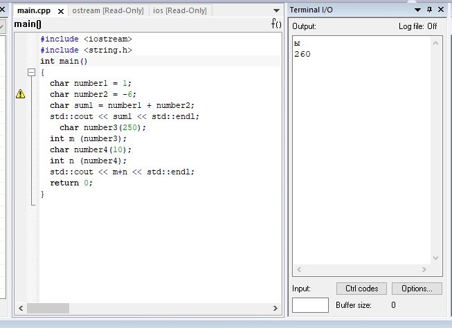
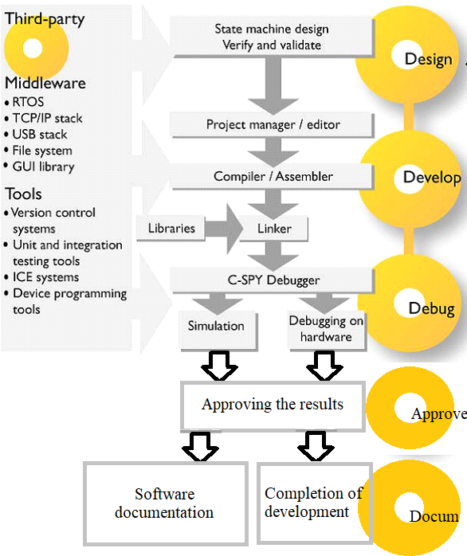

                     Отчёт
               Тимиргазин И.М. КЭ-415
                Лабораторная работа 0

Создал репозиторий "Labs"  на сайте "GitHub", создал папку "lab1" и файл "lab C++", в котором находится код программы, затем пробовал определить места создания наших переменных. Проверил в окне "Watch" переменные и сделал пошаговую отладку, посмотрел как менялись мои переменные, так же в окне "Registers" наблюдал значения, в которых были созданы переменные.

1. Ответ: Интегрированная среда разработки (IDE) - это программное приложение, предоставляющее комплексные возможности программистам для разработки программного обеспечения.
2. Ответ: Компиля́тор — программа или техническое средство, выполняющее компиляцию.
Компилятор отличается от транслятора тем, что его результирующая программа написана обязательно на языке машинных команд или языке ассемблера.
3. Ответ: Компоновщик — инструментальная программа, которая производит компоновку.
может порождать сообщение об ошибке, если при попытке собрать объектные файлы в единое целое он не смог обнаружить какой-либо необходимой составляющей, также выравнивает начальные адреса программных секций и выбирает из первого объектного модуля программную секцию и присваивает ей начальный адрес.
4. Ответ: выбор метода и стратегии решения; выбор представления внутренних данных; разработка основного алгоритма; документирование ПО; тестирование и подбор тестов; выбор представления входных данных.
На каждом из этапов формируется свой комплект документов, называемый проектом (проектной документацией).
5. Ответ:

6. Ответ: отладка необходима для поиска различных ошибок и багов, возникающих  в коде.
7. Ответ: контроль регистров.