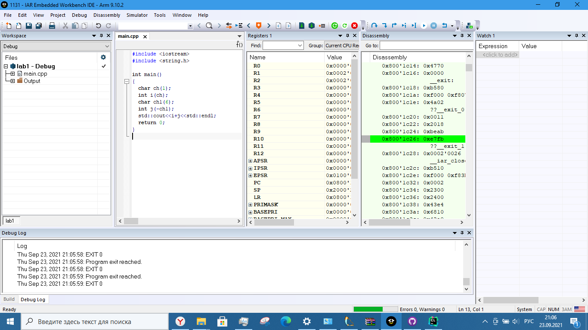

                     Отчёт
               Тимиргазин И.М. КЭ-415
                Лабораторная работа 1

Создал репозиторий "Labs"  на сайте "GitHub", создал папку "lab1" и файл "lab C++", в котором находится код программы, затем пробовал определить места создания наших переменных. Проверил в окне "Watch" переменные и сделал пошаговую отладку, посмотрел как менялись мои переменные, так же в окне "Registers" наблюдал значения, в которых были созданы переменные.
