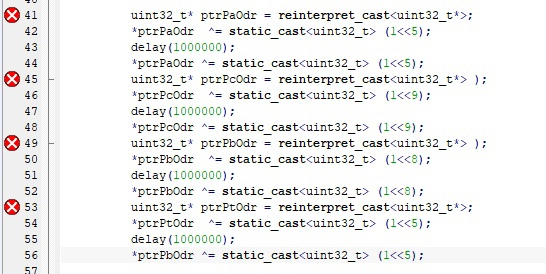
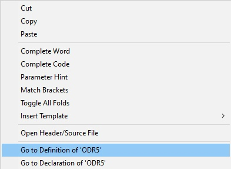
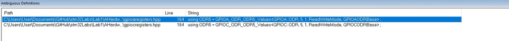
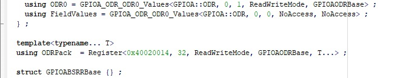
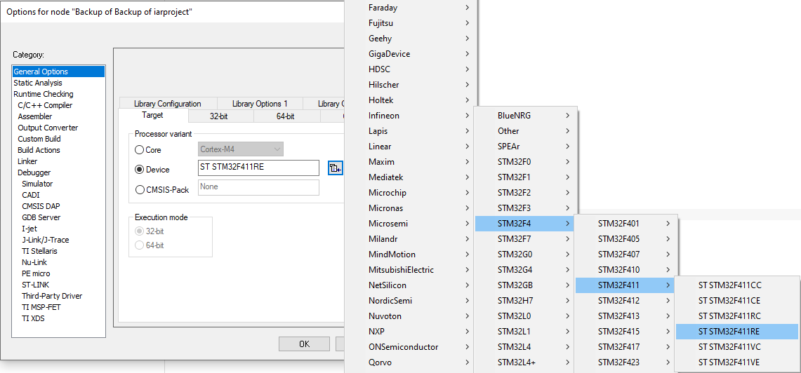
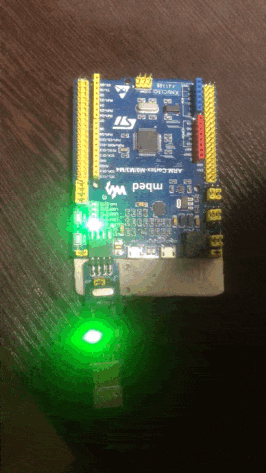
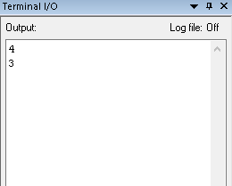

:figure-caption: Рисунок
:toc:
:toc-title: Оглавление
= Отчет по лабораторной работе №3

== Задание к работе
----
а) Написать программу, которая моргает всеми 4 светодиодами, но без использования  GPIOA::ODR::ODR5::High::Set()
б) А также в приложении к отчету нужно описать, как работает операция ИСКЛЮЧАЮЩЕЕ ИЛИ и как поменять значения переменных местами, без привлечения третьей переменной
в) Сделать отчет как обычно

----

== Подключение платы к компьютеру
Для начала нужно посмотреть на саму плату и выяснить, нет ли каких-либо повреждений, если повреждений не обнаружено, то подлючаем нашу плату к компьютеру. Подключение платы к компьютеру показано на рисунке 1.

.Подключение платы к компьютеру
image::image-2021-10-07-13-14-17-596.png[]

== Программа для реализации моргания 4 светодиодами
Напишем программу оторая моргает всеми 4 светодиодами, программа реализации представлена ниже.
[source, c]
----
#include "rccregisters.hpp" // for RCC
#include "gpiocregisters.hpp" //for GPIOC
#include "gpioaregisters.hpp" //for GPIOA
std::uint32_t SystemCoreClock = 16'000'000U;
extern "C"
   {
       int __low_level_init(void)
          {
                //Switch on external 16 MHz oscillator
                RCC::CR::HSION::On::Set();
                while (RCC::CR::HSIRDY::NotReady::IsSet())
                    {
                    }
                //Switch system clock on external oscillator
                RCC::CFGR::SW::Hsi::Set();
                while (!RCC::CFGR::SWS::Hsi::IsSet())
                    {
                    }
                RCC::APB2ENR::SYSCFGEN::Enable::Set();
            return 1;
          }
   }
int delay(int cycles)
{
   for (int i =0; i< cycles; ++i)
      {
          asm volatile ("");
      }
}
int main()
{
    RCC::AHB1ENR::GPIOAEN::Enable::Set();
    RCC::AHB1ENR::GPIOCEN::Enable::Set();
    GPIOA::MODER::MODER5::Output::Set();
    GPIOC::MODER::MODER8::Output::Set();
    GPIOC::MODER::MODER9::Output::Set();
    GPIOC::MODER::MODER5::Output::Set();
      {
         for (;;)
            {
                uint32_t* ptrPaOdr = reinterpret_cast<uint32_t*> ();
                *ptrPaOdr ^= static_cast<uint32_t> (1<<5);
                delay(1000000);
                *ptrPaOdr ^= static_cast<uint32_t> (1<<5);
                uint32_t* ptrPcOdr = reinterpret_cast<uint32_t*>();
                *ptrPcOdr ^= static_cast<uint32_t> (1<<9);
                delay(1000000);
                *ptrPcOdr ^= static_cast<uint32_t> (1<<9);
                uint32_t* ptrPbOdr = reinterpret_cast<uint32_t*> ();
                *ptrPbOdr ^= static_cast<uint32_t> (1<<8);
                delay(1000000);
                *ptrPbOdr ^= static_cast<uint32_t> (1<<8);
                uint32_t* ptrPtOdr = reinterpret_cast<uint32_t*> ();
                *ptrPtOdr ^= static_cast<uint32_t> (1<<5);
                delay(1000000);
                *ptrPbOdr ^= static_cast<uint32_t> (1<<5);
            }
        return 1;
      }
}
----
После того, как мы запустили программу, вылезли ошибки, представленные на рисунке 2.

.Ошибка

Для того чтобы убрать эти ошибки, нам необходимо воспользоваться доступом к прямой памяти по адресам.

Чтобы воспользоваться доступом нужно найти найти старую закомментированную строчку GPIOC::ODR::ODR5::Low::Set(); нажать правой кнопкой мыши по ODR5 и выбрать пункт Go to Definition of 'ODR5'.

.Go to Definition 'ODR5'

Далее выбираем путь как показано на рисунке 4

.Путь

И смотрим регистр необходимый для правильной работы нашей программы. Это представлено ниже.

.Доступ к прямой памяти по адресам

Остальные регистры находим таким же способом

Следующим шагом является заполнение найденных регистров в программу

[source, c]
----
#include "rccregisters.hpp" // for RCC
#include "gpiocregisters.hpp" //for GPIOC
#include "gpioaregisters.hpp" //for GPIOA
std::uint32_t SystemCoreClock = 16'000'000U;
extern "C"
   {
       int __low_level_init(void)
          {
                //Switch on external 16 MHz oscillator
                RCC::CR::HSION::On::Set();
                while (RCC::CR::HSIRDY::NotReady::IsSet())
                    {
                    }
                //Switch system clock on external oscillator
                RCC::CFGR::SW::Hsi::Set();
                while (!RCC::CFGR::SWS::Hsi::IsSet())
                    {
                    }
                RCC::APB2ENR::SYSCFGEN::Enable::Set();
            return 1;
          }
   }
int delay(int cycles)
{
   for (int i =0; i< cycles; ++i)
      {
          asm volatile ("");
      }
}
int main()
{
    RCC::AHB1ENR::GPIOAEN::Enable::Set();
    RCC::AHB1ENR::GPIOCEN::Enable::Set();
    GPIOA::MODER::MODER5::Output::Set();
    GPIOC::MODER::MODER8::Output::Set();
    GPIOC::MODER::MODER9::Output::Set();
    GPIOC::MODER::MODER5::Output::Set();
      {
         for (;;)
            {
                uint32_t* ptrPaOdr = reinterpret_cast<uint32_t*> (0x40020014);
                *ptrPaOdr ^= static_cast<uint32_t> (1<<5);
                delay(1000000);
                *ptrPaOdr ^= static_cast<uint32_t> (1<<5);
                uint32_t* ptrPcOdr = reinterpret_cast<uint32_t*> (0x40020814);
                *ptrPcOdr ^= static_cast<uint32_t> (1<<9);
                delay(1000000);
                *ptrPcOdr ^= static_cast<uint32_t> (1<<9);
                uint32_t* ptrPbOdr = reinterpret_cast<uint32_t*> (0x40020814);
                *ptrPbOdr ^= static_cast<uint32_t> (1<<8);
                delay(1000000);
                *ptrPbOdr ^= static_cast<uint32_t> (1<<8);
                uint32_t* ptrPtOdr = reinterpret_cast<uint32_t*> (0x40020814);
                *ptrPtOdr ^= static_cast<uint32_t> (1<<5);
                delay(1000000);
                *ptrPbOdr ^= static_cast<uint32_t> (1<<5);
            }
        return 1;
      }
}
----

== Прошивка платы
Для начала нужно создать проект, после чего в свойствах проекта выберем модель микроконтроллера ST => STM32F4 => STM32F411 => ST STM32F411RE (рисунок 6). Для этого правой кнопкой мыши щелкнем по проекту, выберем Options и далее в категории General Option выберем вкладку Target.

.Выбор модели микроконтроллера

После всех выполненных нами действиями, видим, что наша плата прошилась и горят все 4 светодиода в поочередной последовательности, что показано на рисунке 7.

.Реализация поочередной последовательности загорания 4 светодиодов

== Приложение

Покажем как работает операция ИСКЛЮЧАЮЩЕЕ ИЛИ и для этого напишем программу которая меняет значения переменных местами, без привлечения третьей переменной.

Код программы показан ниже

[source, c]
----
#include <iostream>
int a=3;
int b=4;
int main()
{
   a = a ^ b;
   b = b ^ a;
   a = a ^ b;
   std::cout<<a<<std::endl;
   std::cout<<b<<std::endl;
   return 1;
}
----

Результат данного кода представлен на рисунке 8

.Результат

Теперь объясним как работатет ИСКЛЮЧАЮЩЕЕ ИЛИ:

^ исключающее ИЛИ — бинарная операция, результат которой равен 1, если только один из двух операндов равен 1 (в общем случае если во входном наборе операндов нечетное число единиц).

Для каждого бита результат выполнения операции будет получен в соответствии с таблицей на рисунке 9.

.Таблица преобразования исключающего ИЛИ
image::Таблица.png[]

Таким образом, исходя из данной таблицы наши числа образуют:
[source, c]
----
3 (0011)
4 (0100)
--------------
7 (0111)
----