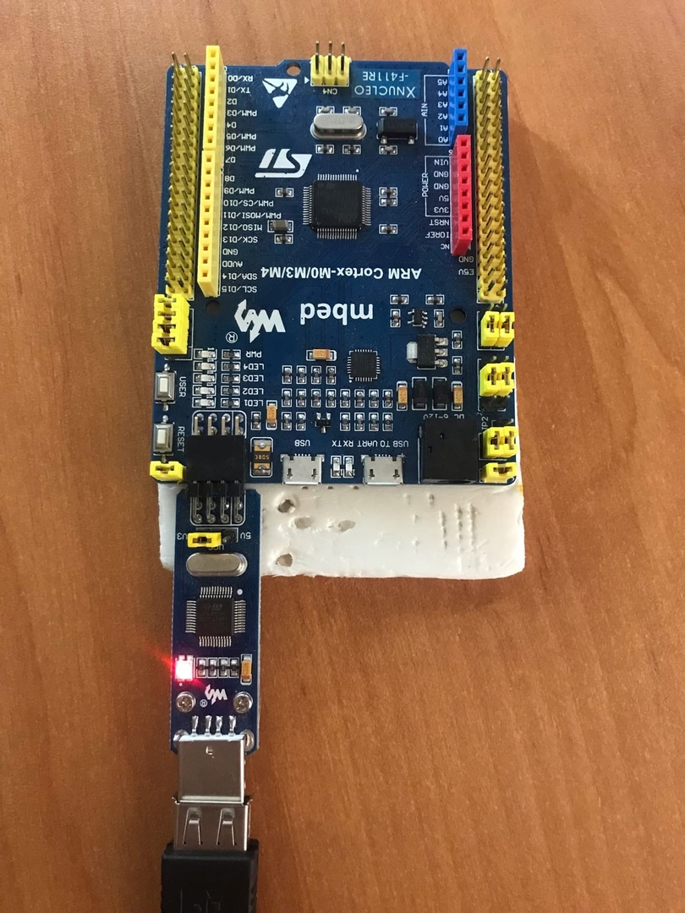
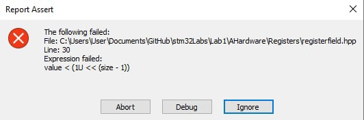

:imagesdir: images
:figure-caption: Рисунок
:toc:
:toc-title: Оглавление
= Отчет по лабораторной работе №4

== Задание к работе
----
а) Сделать тактирование системной частоты произвести с модуля PLL, так, чтобы системная частота была 30 МГц.
б) Сделать отчет как обычно
----

== Подключение платы к компьютеру
Для начала нужно посмотреть на саму плату и выяснить, нет ли каких-либо повреждений, если повреждений не обнаружено, то подлючаем нашу плату к компьютеру. Подключение платы к компьютеру показано на рисунке 1.

.Подключение платы к компьютеру

== Модуль тактирования.
Модуль тактирования (Reset and Clock Control) RCC

* Для формирования системной тактовой частоты SYSCLK могут использоваться 4 основных источника:
** HSI (high-speed internal) — внутренний высокочастотный RC-генератор.
** HSE (high-speed external) — внешний высокочастотный генератор.
** PLL — система ФАПЧ. Точнее сказать, это вовсе и не генератор, а набор из умножителей и делителей,
исходный сигнал он получает от HSI или HSE, а на выходе у него уже другая частота.

== Фазовая подстройка частоты PLL
* PLL Внутренний источник PLL тактируется от внешнего или внутреннего высокочастотных генераторов (HSE либо HSI).
** С помощью регистров PLLM, PLLN,PLLP можно подобрать любую частоту до 100 Мгц включительно по формуле:
====
   f = f(PLL clock input) × (PLLN / PLLM) /PLLP
====
** Кроме системной тактовой частоты SYSCLK, PLL также выдает частоту 48 МГц для интерфейса USB.
При использовании USB входная частота для PLL должна быть в диапазоне от 2 МГц до 24 МГц.
====
   f(USB) = f(PLL clock input) × (PLLN / PLLM) / PLLQ
====

Поэтому для получения частоты 30 МГц из 16 МГц нам необходимо рассчитать эти значения:
====
   (16 * 60) / 32 = 30 МГц
====

Для настройки частоты произведем следующие дейсвтия:

* Включаем источник частоты *HSE*;

* выбираем *HSE* в качестве источника тактирования;

* настраиваем *PLL*;

* выключаем *HSI*;

* устанавливаем *HSE* источником;

* включаем *PLL*, ожидаем его готовности.

== Программа для реализации тактирования модуля PLL
Напишем программу оторая моргает всеми 4 светодиодами, программа реализации представлена ниже.
[source, c]
----
#include "rccregisters.hpp" // for RCC
#include "gpiocregisters.hpp" //for GPIOC
#include "gpioaregisters.hpp" //for GPIOA
std::uint32_t SystemCoreClock = 16'000'000U;
extern "C"
   {
       int __low_level_init(void)
          {
                //Switch on external 16 MHz oscillator
                RCC::CR::HSION::On::Set();
                while (RCC::CR::HSIRDY::NotReady::IsSet())
                    {
                    }
                //Switch system clock on external oscillator
                RCC::PLLCFGR::PLLN0::Set(60);
                RCC::PLLCFGR::PLLP0::Set(32);
                RCC::CR::PLLON::On::Set();
                while (RCC::CR::PLLRDY::Unclocked::IsSet())
                {
                }
                RCC::CFGR::SW::Pll::Set();
                while (!RCC::CFGR::SWS::Pll::IsSet())
                {
                }
             return 1;
          }
   }
int delay(int cycles)
{
   for (int i =0; i< cycles; ++i)
      {
          asm volatile ("");
      }
}
int main()
{
    RCC::AHB1ENR::GPIOAEN::Enable::Set();
    RCC::AHB1ENR::GPIOCEN::Enable::Set();
    GPIOA::MODER::MODER5::Output::Set();
    GPIOC::MODER::MODER8::Output::Set();
    GPIOC::MODER::MODER9::Output::Set();
    GPIOC::MODER::MODER5::Output::Set();
      {
         for (;;)
            {
            uint32_t* ptrPaOdr = reinterpret_cast<uint32_t*>(0x40020014);
            *ptrPaOdr ^= static_cast<uint32_t>(1 << 5);
            uint32_t* ptrPcOdr = reinterpret_cast<uint32_t*>(0x40020814);
            *ptrPcOdr ^= static_cast<uint32_t>(1 << 9);
            *ptrPcOdr ^= static_cast<uint32_t>(1 << 8);
            *ptrPcOdr ^= static_cast<uint32_t>(1 << 5);
            delay(1500000);
            *ptrPaOdr ^= static_cast<uint32_t>(1 << 5);
            *ptrPcOdr ^= static_cast<uint32_t>(1 << 9);
            *ptrPcOdr ^= static_cast<uint32_t>(1 << 8);
            *ptrPcOdr ^= static_cast<uint32_t>(1 << 5);
            delay(1500000);
            }
        return 1;
      }
}
----
После того, как мы запустили программу, вылезла ошибка, представленные на рисунке 2.

.Ошибка

Для того, чтобы программа продолжила свою работу, нажмем кнопку *ignore*.

== Реализация программы на плате
Реализация программы на плате показана на рисунке 3.

.Реализация программы на плате
image::file.gif[]

